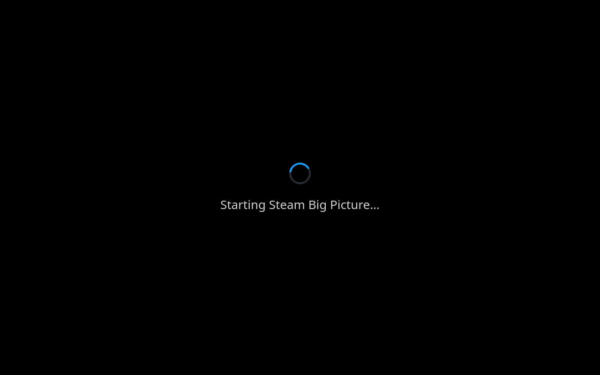
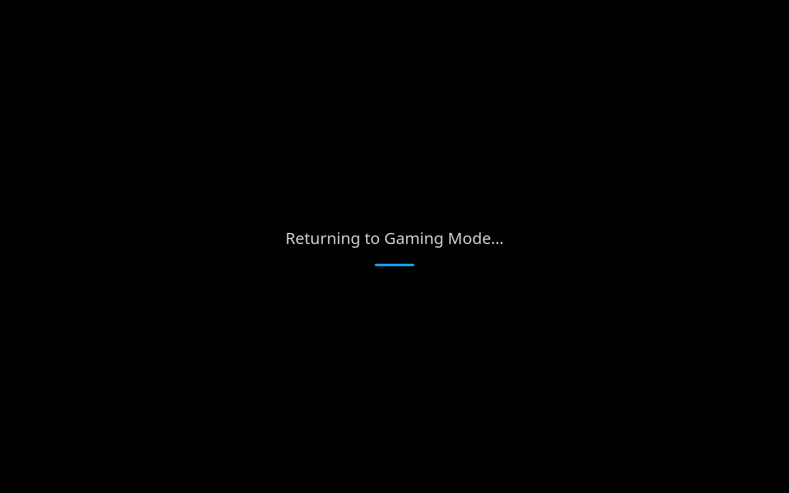

<div align="center">

# Quickscope

**Launch Moonlight and other streaming clients outside Gamescope, straight from Gaming Mode.**

A [Decky Loader](https://github.com/SteamDeckHomebrew/decky-loader) plugin for the Steam Deck

 

</div>

Quickscope runs a single app in a stripped-down Plasma Wayland session and returns you to Gaming Mode when it exits. Pick a game from your host's app list and you're streaming it about **8 seconds** later.

## Why

Moonlight's statistics, streaming *Batman: Arkham Knight* from [Vibeshine](https://github.com/Nonary/vibeshine) to a Steam Deck LCD with the same settings (V-Sync on):

| Codec | Gaming Mode | Quickscope | Difference |
|---|---:|---:|---:|
| HEVC | 7.03 ms | **1.33 ms** | −5.7 ms (−81%) |
| PyroWave | 0.93 ms | **0.51 ms** | −0.4 ms (−45%) |

*Average rendering time, including display sync.* Data and method in [docs/latency.md](docs/latency.md).

## Features

- **Straight into a stream:** your Moonlight hosts' apps are in the panel, and the loading screen stays up until the stream is playing
- **Your controller layout** keeps working through Steam's desktop layout
- **A quiet session:** no Plasma panel or KDE background helpers, power profiles, Wi-Fi power saving off
- **Reconnects** a stream that drops, e.g. after sleep
- **Per-display Moonlight settings** (optional), and Gaming Mode's resolution, refresh rate and HDR when docked
- **Brightness, volume, battery and a way out** in place of the Quick Access menu
- **Leaves no trace:** every change is undone on exit, even after a crash

## Install

> Requires **SteamOS 3.9+** and [Decky Loader](https://github.com/SteamDeckHomebrew/decky-loader).

In Decky, go to **Settings → Developer** (enable Developer mode if it's missing), choose **Install Plugin from URL** and enter:

```
https://github.com/ellierocks/quickscope/releases/latest/download/Quickscope.zip
```

The same steps update it. Or download `Quickscope.zip` from the [latest release](../../releases/latest) and use **Install Plugin from ZIP**.

## Usage

Open **Quickscope** from the Quick Access menu. The panel lists your pinned entries, then each Moonlight host's apps, then Moonlight itself; search finds any other app. Steam games also get a **Quickscope** button on their library page.

| Button | |
|:---:|---|
| **A** | Launch |
| **X** | Pin / unpin |
| **Y** | Switch launch method (non-Steam apps) |

| Launch method | Controller |
|---|---|
| **Hybrid** *(default)*: the app starts at once, Steam in the background | Steam's **desktop layout**, from about 2 s in |
| **Direct**: no Steam | Raw Deck controller, no Steam Input |
| *Steam games*: through desktop Steam, about 13 s to start | The game's own layout |

> [!NOTE]
> Quickscope is built for **streaming clients**. Steam games work, but local games have little to gain, so Gaming Mode is usually better for them.

> [!TIP]
> With **Hybrid**, set up the desktop layout (*Steam → Settings → Controller → Desktop Layout*) for your apps. For Moonlight, a gamepad layout with trackpad mouse and paddle clicks works well.

### Moonlight

- Install Moonlight from Discover (or add its AppImage to Steam as a non-Steam game) and pair it with your PC. Its hosts' apps appear in the panel, read from Moonlight's saved list (open Moonlight to refresh it).
- To open Moonlight itself from the panel, add it as a non-Steam shortcut.
- Quit a stream with **L1 + R1 + Start + Select**.

**Per-display settings (optional).** *Settings → Moonlight settings* gives each display its own resolution, frame rate, codec, bitrate, YUV 4:4:4, V-Sync, frame pacing, HDR, stats overlay and keep-awake, with PyroWave and VRR for [Nonary's fork](https://github.com/Nonary/moonlight-qt). They're swapped into Moonlight for the session and your own settings are put back afterwards, so change them there, not in Moonlight.

### Settings

| Setting | Default |
|---|---|
| Return to Gaming Mode on exit | On |
| Force fullscreen | On |
| Reconnect dropped streams | On |
| Power profile: Automatic, High performance or Battery saver (about 40% less power) | Automatic: Battery saver on battery |
| Sleep / turn off screen when idle | SteamOS default (on battery: 5 min / 1 min) |
| Disable Wi-Fi power saving (it causes latency spikes) | On |
| Lock Wi-Fi access point (WPA Supplicant backend only) | On |
| Starting brightness | Gaming Mode's |
| Lock brightness | On |
| Display mode and HDR | Match Gaming Mode |
| Scale | 100% |

### Controls

- **Brightness:** hold **…** and push the left stick up or down
- **Battery:** tap **…** for the level and time left
- **Quit:** hold **…** for 3 seconds
- **Volume:** the volume buttons, with an indicator
- Low-battery warnings at 20%, 10% and 2%

## Troubleshooting

- **Stuck?** Hold **…** for 3 seconds. If the launcher crashes, a recovery job returns to Gaming Mode on its own. From a terminal: `steamos-session-select gamescope`.
- **Stream dropped?** It reconnects once the network is back, for up to 3 minutes, then leaves Moonlight's error up.
- **Black screen on the way back?** Normal for a few seconds while Gaming Mode starts.
- **Wi-Fi drops when the desktop starts?** SteamOS's *Force WPA Supplicant Wi-Fi backend* setting (Developer settings) restarts the network whenever Steam starts. Quickscope waits for it; turning the setting off avoids it.
- **No loading screen when docked?** Expected: the TV re-syncs after the app opens.
- **Decky gone after several very short sessions?** Its crash protection triggers on quick round trips. Restart the Deck.
- **Logs:** `~/.local/state/quickscope/launcher.log`, and Decky's in `~/homebrew/logs/Quickscope/`.
- **Undo everything by hand:** `python3 ~/.local/state/quickscope/quickscope_launcher.py --restore`

<details>
<summary><b>How it works</b></summary>

1. The plugin stages the launch, applies the tweaks below and switches to Plasma on Wayland. Gamescope's process is killed 0.3 s into its shutdown, since it often hangs or aborts.
2. `quickscope-launch.service` starts the launcher as soon as KWin is up. If the launcher dies, `quickscope-recover.service` undoes the session and returns.
3. The launcher shows the loading screen, loads a KWin script (fullscreen the app, keep Steam's window minimized) and starts the app.
4. When the app exits, every tweak is undone and the Deck returns to Gaming Mode.

Each tweak is recorded in `~/.local/state/quickscope/undo.json`, and undone on exit or, if that's interrupted, when the plugin next loads.

| Tweak | How |
|---|---|
| Steam and KDE helpers skipped | `Hidden=true` autostart overrides; `kde-baloo.service` and `plasma-plasmashell.service` masked with `--runtime` |
| No splash screen | `Engine=none` in `~/.config/ksplashrc` |
| Idle timers *(setting)* | `~/.config/powerdevilrc`; untouched with the SteamOS defaults |
| Brightness | Writes `/sys/class/backlight/*/brightness`, re-applied if KDE changes it |
| Display | Read with `modetest` in Gaming Mode, set with `kscreen-doctor`; `plasma-kscreen-osd.service` masked |
| Wi-Fi *(settings)* | Power saving off with `steamosctl`; access point locked with `nmcli … 802-11-wireless.bssid` |
| Power profile *(setting)* | GPU level, CPU governor and boost with `steamosctl`; the kernel's scheduler instead of `scx_lavd` (about 1 W less) |
| Moonlight thread priority | Moonlight's own request fails inside Flatpak on SteamOS, so the launcher asks RealtimeKit for it |

Steam is started as `/usr/lib/steam/steam -steamdeck -silent -noverifyfiles -skipinitialbootstrap -norepairfiles`, bypassing the wrapper's `-pipewire` flag (a screen-capture prompt on Wayland) and the file check after Gaming Mode's Steam is killed.

</details>

<details>
<summary><b>Development</b></summary>

```sh
pnpm install
pnpm typecheck
pnpm lint       # ESLint, Prettier and Ruff (through uvx)
pnpm format
pnpm test       # Python unit tests
pnpm package    # out/Quickscope.zip
```

Pushing a tag matching `package.json`'s version (e.g. `v1.0.0`) publishes a release. Tested on a Steam Deck LCD with SteamOS 3.9.2, Plasma 6.7 and Decky Loader 3.2.

</details>

## About

Most of Quickscope's code was written with Claude, directed and tested on real hardware by its author. Decky's plugin store doesn't accept mostly AI-written code, so it's distributed here instead.

## License

[BSD-3-Clause](LICENSE)
